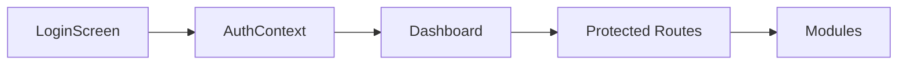
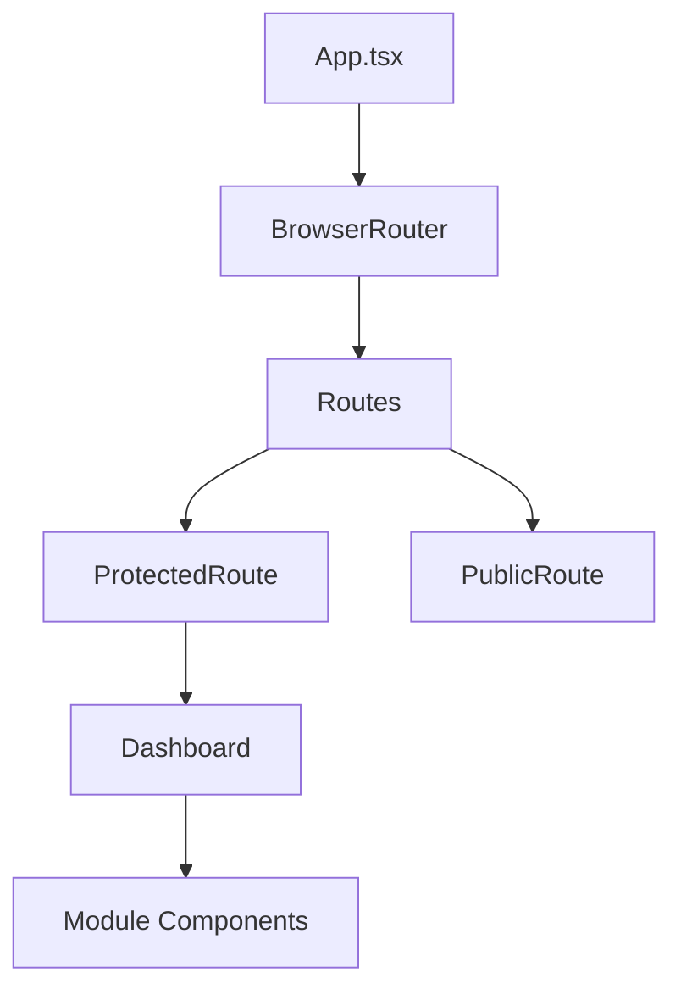
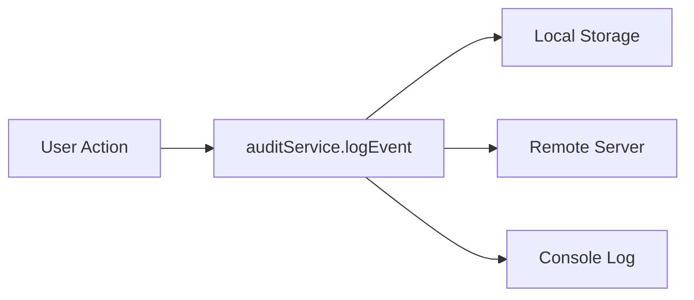

# Documentation Technique - DGI Access Application

## 🏗 Architecture Logicielle

### Vue d'ensemble

L'application suit une architecture modulaire basée sur React avec une séparation claire des responsabilités :

```text
┌─────────────────┐    ┌─────────────────┐    ┌─────────────────┐
│   Présentation  │    │     Logique     │    │    Services     │
│   (Components)  │◄──►│   (Contexts)    │◄──►│   (Utils/API)   │
└─────────────────┘    └─────────────────┘    └─────────────────┘
```

### Couches applicatives

#### 1. Couche Présentation

- **Composants React** : Interface utilisateur réactive
- **Routing** : Navigation basée sur React Router DOM
- **Design System** : Composants UI réutilisables

#### 2. Couche Logique Métier

- **Contexts** : Gestion d'état globale (Auth, Theme)
- **Hooks** : Logique réutilisable et effets de bord
- **Types** : Définitions TypeScript strictes

#### 3. Couche Services

- **API Services** : Communication avec services externes
- **Audit Service** : Traçabilité et logging
- **AI Service** : Extraction de données par IA

## 🔄 Flux de données

### Authentification



### Navigation



### Audit



## 🧩 Modules Fonctionnels

### 1. Gestion des Visiteurs

**Fichiers principaux :**

- `VisitorManagementModule.tsx` : Interface principale
- `VisitorRegistrationForm.tsx` : Formulaire d'enregistrement
- `VisitorsList.tsx` : Liste avec filtres et recherche
- `VisitorStatistics.tsx` : Métriques et graphiques

**Fonctionnalités :**

- Enregistrement manuel ou via IA
- Planification des visites
- Export CSV des données
- Génération automatique de badges

### 2. Intelligence Artificielle

**Fichier principal :** `src/utils/aiExtraction.ts`

**Architecture :**

```typescript
interface AIConfig {
  provider: 'mock' | 'openai' | 'anthropic' | 'azure' | 'google';
  apiKey?: string;
  endpoint?: string;
  model?: string;
  maxRetries: number;
  timeout: number;
}
```

**Flux d'extraction :**

1. Upload/capture d'image
2. Preprocessing (amélioration qualité)
3. Appel API IA avec prompt structuré
4. Parsing et validation des résultats
5. Retour avec score de confiance

**Gestion d'erreurs :**

- Retry automatique avec backoff exponentiel
- Fallback vers mode mock en cas d'échec
- Logging détaillé des erreurs

### 3. Système d'Audit

**Fichier principal :** `src/services/auditService.ts`

**Types d'événements trackés :**

```typescript
type AuditAction = 
  | 'LOGIN' | 'LOGOUT' | 'FAILED_LOGIN'
  | 'CREATE_VISITOR' | 'UPDATE_VISITOR' | 'DELETE_VISITOR'
  | 'AI_EXTRACTION' | 'EXPORT_DATA'
  | 'SYSTEM_CONFIG_CHANGE' | 'SENSITIVE_DATA_ACCESS';
```

**Niveaux de risque :**

- `low` : Actions standard (connexion, consultation)
- `medium` : Modifications de données, accès sensible
- `high` : Suppressions, changements de configuration
- `critical` : Tentatives d'intrusion, actions suspectes

## 🔒 Sécurité

### Authentification et autorisation

```typescript
interface User {
  id: string;
  username: string;
  role: 'ADMIN' | 'RECEPTION';
  permissions: string[];
  sessionExpiry: string;
}
```

### Protection des routes

```typescript
function ProtectedRoute({ 
  children, 
  allowedRoles 
}: { 
  children: React.ReactNode; 
  allowedRoles?: string[] 
}) {
  // Vérification user + rôles
  // Redirection si non autorisé
}
```

### Gestion des secrets

- Variables d'environnement pour clés API
- Pas de secrets en dur dans le code
- Configuration séparée par environnement

## 🧪 Tests

### Structure des tests

```text
src/
├── components/__tests__/
├── utils/__tests__/
├── services/__tests__/
└── test/
    └── setup.ts
```

### Configuration Vitest

```typescript
export default defineConfig({
  test: {
    globals: true,
    environment: 'jsdom',
    setupFiles: './src/test/setup.ts',
    css: true,
  },
});
```

### Mocks standard

- `localStorage` et `sessionStorage`
- `ResizeObserver` et `IntersectionObserver`
- `matchMedia` pour responsive
- `AuthContext` pour tests de composants

## 📊 Performance

### Optimisations implémentées

1. **Code splitting** : Routes lazy-loadées
2. **Tree shaking** : Élimination du code mort
3. **Bundle optimization** : Vite avec optimisations Rollup
4. **Image optimization** : Preprocessing avant extraction IA

### Métriques surveillées

- Temps de chargement initial
- Temps de réponse des extracteurs IA
- Taille des bundles JavaScript
- Consommation mémoire localStorage

## 🔧 Configuration Avancée

### Variables d'environnement critiques

```env
# Production uniquement
VITE_AI_PROVIDER=openai
VITE_AI_API_KEY=sk-...
VITE_AUDIT_ENDPOINT=https://audit.company.com
VITE_ENCRYPTION_KEY=32-char-hex-key

# Développement
VITE_AI_PROVIDER=mock
VITE_DEV_MODE=true
```

### Configuration TypeScript

```json
{
  "compilerOptions": {
    "strict": true,
    "noUncheckedIndexedAccess": true,
    "exactOptionalPropertyTypes": true
  }
}
```

## 🚀 Déploiement

### Pipeline CI/CD recommandé

1. **Lint** : ESLint + TypeScript check
2. **Test** : Vitest avec coverage
3. **Build** : Production build avec Vite
4. **Deploy** : Upload vers CDN/serveur statique

### Variables d'environnement par stage

```bash
# Development
VITE_AI_PROVIDER=mock
VITE_AUDIT_LEVEL=debug

# Staging  
VITE_AI_PROVIDER=openai
VITE_AI_API_KEY=sk-staging-...
VITE_AUDIT_LEVEL=info

# Production
VITE_AI_PROVIDER=openai
VITE_AI_API_KEY=sk-prod-...
VITE_AUDIT_LEVEL=warn
VITE_AUDIT_ENDPOINT=https://audit.prod.com
```

## 🐛 Debugging

### Outils de développement

1. **React DevTools** : Inspection des composants
2. **Console logs** : Audit events en mode dev
3. **Network tab** : Monitoring des appels API IA
4. **Vite HMR** : Hot reload pendant développement

### Logs d'audit en développement

```typescript
if (import.meta.env.DEV) {
  console.log(`[AUDIT] ${event.action}: ${event.details}`, event);
}
```

## 📈 Monitoring

### Métriques business

- Nombre de visiteurs enregistrés/jour
- Précision moyenne extraction IA
- Temps moyen de traitement
- Événements d'audit par criticité

### Alertes recommandées

- Échecs d'extraction IA > 10%
- Tentatives de connexion échouées > 5/min
- Événements audit "critical"
- Erreurs JavaScript côté client

## 🔄 Évolutions futures

### Roadmap technique

1. **WebSockets** : Notifications temps réel
2. **PWA** : Mode offline avec sync
3. **Microservices** : API backend dédiée
4. **ML local** : Extraction IA hors ligne

### Extensibilité

- Plugin system pour nouveaux modules
- API standardisée pour intégrations tierces
- Support multi-tenant
- Internationalisation avancée

---

## 📚 Documentation maintenue par l'équipe technique ORGANEUS Gabon
